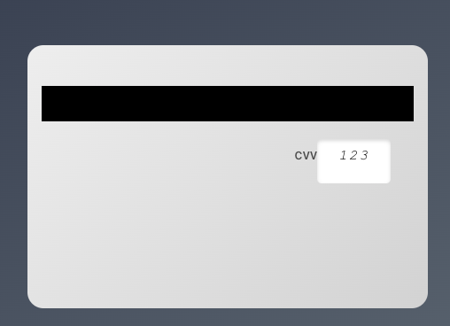

# React Credit Card UI - Modern React Credit Card Component

[](https://www.npmjs.com/package/react-credit-card-ui) 
[](https://www.npmjs.com/package/react-credit-card-ui)
[](https://github.com/iamalperen/cardify/actions/workflows/main.yml)
[](https://bundlephobia.com/package/react-credit-card-ui)
[](https://www.npmjs.com/package/react-credit-card-ui)

A customizable React component to display credit card information with a sleek UI, smooth animations, and responsive design principles.

## Live Demo

Check out the live demo: [https://react-credit-card-ui.vercel.app/](https://react-credit-card-ui.vercel.app/)

## Screenshots

### Front Side of Card


### Back Side of Card (with CVV)


## Features

*   **Fully Responsive:** Adapts fluidly to any container size using modern CSS.
*   **Modern Design:** Clean and visually appealing credit card presentation with 3D flip effect.
*   **Card Detection:** Automatically detects and styles based on card issuer (Visa, Mastercard, Amex, etc.).
*   **Customizable:** Easily adjust size (`width`, `maxWidth`), appearance (via `className`), and behavior (`flipOnClick`).
*   **Internationalization:** Built-in support for Right-to-Left (RTL) languages (`direction` prop) and customizable text labels.
*   **Accessibility:** Implemented with ARIA attributes and basic keyboard navigation for the flip interaction.
*   **Lightweight:** Minimal dependencies with a small bundle size (~10KB gzipped).
*   **TypeScript Support:** Fully typed component with exported types.
*   **Browser Support:** Works on all modern browsers (Chrome, Firefox, Safari, Edge).

## Installation

```bash
npm install react-credit-card-ui
# or
yarn add react-credit-card-ui
```

## Usage

### Basic Usage

```jsx
import React, { useState } from 'react';
import { CreditCard } from 'react-credit-card-ui';
// Optional: Import CSS if your setup doesn't automatically handle package CSS
// import 'react-credit-card-ui/dist/style.css'; 
import './App.css';

function App() {
  const [cardNumber, setCardNumber] = useState('4242424242424242');
  const [cardHolder, setCardHolder] = useState('Jane Doe');
  const [expiryDate, setExpiryDate] = useState('12/25');
  const [cvv, setCvv] = useState('123');

  return (
    <div className="App">
      <h1>React Credit Card UI Demo</h1>

      {/* Basic Usage (will take 100% width up to 420px max-width) */}
      <CreditCard
        cardNumber={cardNumber}
        cardHolder={cardHolder}
        expiryDate={expiryDate}
        cvv={cvv}
      />
    </div>
  );
}

export default App;
```

### With Form Integration

```jsx
import React, { useState } from 'react';
import { CreditCard } from 'react-credit-card-ui';

function PaymentForm() {
  const [cardNumber, setCardNumber] = useState('');
  const [cardHolder, setCardHolder] = useState('');
  const [expiryDate, setExpiryDate] = useState('');
  const [cvv, setCvv] = useState('');

  const handleSubmit = (e) => {
    e.preventDefault();
    // Handle payment processing
    console.log({ cardNumber, cardHolder, expiryDate, cvv });
  };

  return (
    <div className="payment-form-container">
      <CreditCard
        cardNumber={cardNumber}
        cardHolder={cardHolder}
        expiryDate={expiryDate}
        cvv={cvv}
      />
      
      <form onSubmit={handleSubmit}>
        <div className="form-group">
          <label htmlFor="cardNumber">Card Number</label>
          <input
            id="cardNumber"
            type="text"
            value={cardNumber}
            onChange={(e) => setCardNumber(e.target.value)}
            placeholder="Card Number"
          />
        </div>
        
        <div className="form-group">
          <label htmlFor="cardHolder">Card Holder</label>
          <input
            id="cardHolder"
            type="text"
            value={cardHolder}
            onChange={(e) => setCardHolder(e.target.value)}
            placeholder="Card Holder Name"
          />
        </div>
        
        <div className="form-row">
          <div className="form-group">
            <label htmlFor="expiryDate">Expiry Date</label>
            <input
              id="expiryDate"
              type="text"
              value={expiryDate}
              onChange={(e) => setExpiryDate(e.target.value)}
              placeholder="MM/YY"
            />
          </div>
          
          <div className="form-group">
            <label htmlFor="cvv">CVV</label>
            <input
              id="cvv"
              type="text"
              value={cvv}
              onChange={(e) => setCvv(e.target.value)}
              placeholder="CVV"
            />
          </div>
        </div>
        
        <button type="submit">Pay Now</button>
      </form>
    </div>
  );
}

export default PaymentForm;
```

### Additional Examples

```jsx
// Custom Size Example
<div style={{ width: '350px', margin: '2rem auto' }}>
  <CreditCard
    cardNumber={cardNumber}
    cardHolder={cardHolder}
    expiryDate={expiryDate}
    cvv={cvv}
    width="100%" // Inherits width from parent div
    maxWidth="none" // Can override default max-width
  />
</div>

// RTL and Custom Labels Example
<CreditCard
  cardNumber={cardNumber}
  cardHolder={cardHolder}
  expiryDate={expiryDate}
  cvv={cvv}
  direction="rtl"
  cardHolderLabel="اسم حامل البطاقة"
  expiresLabel="تاريخ الانتهاء"
  cvvLabel="رقم التحقق"
  className="my-custom-card-style" // Add custom styles
/>
```

## Props

| Prop                | Type                      | Default              | Description                                                                 |
| :------------------ | :------------------------ | :------------------- | :-------------------------------------------------------------------------- |
| `cardNumber`        | `string`                  | `#### #### #### ####`| The credit card number.                                                     |
| `cardHolder`        | `string`                  | `CARD HOLDER`        | The name of the cardholder.                                                 |
| `expiryDate`        | `string`                  | `MM/YY`              | The card's expiration date (format MM/YY or similar).                       |
| `cvv`               | `string`                  | `''`                 | The Card Verification Value (CVV). Displayed on the back of the card.       |
| `issuer`?           | `CardType`                | Auto-detected        | Force a specific card issuer (e.g., 'visa', 'mastercard').                 |
| `flipOnClick`?      | `boolean`                 | `true`               | Allow flipping the card on click/enter to show the CVV.                     |
| `width`?            | `string`                  | `undefined`          | Set a specific width for the card wrapper (e.g., '350px', '100%').           |
| `maxWidth`?         | `string`                  | `undefined`          | Override the default `max-width` (420px) via CSS variable `--card-max-width`. |
| `direction`?        | `'ltr' \| 'rtl'`         | `'ltr'`              | Set text direction for Right-to-Left language support.                      |
| `cardHolderLabel`?  | `string`                  | `Card Holder`        | Custom text label for the card holder field.                                |
| `expiresLabel`?     | `string`                  | `Expires`            | Custom text label for the expiry date field.                                |
| `cvvLabel`?         | `string`                  | `CVV`                | Custom text label for the CVV field on the back.                            |
| `className`?        | `string`                  | `''`                 | Optional CSS class name(s) to add to the main wrapper element.              |
| `ariaLabel`?        | `string`                  | Varies               | Custom ARIA label for the interactive card container element.               |
| `wrapperAriaLabel`? | `string`                  | `Credit card ...`    | Custom ARIA label for the main wrapper element.                             |
| `cardFrontAriaLabel`?| `string`                  | `Card front`         | Custom ARIA label for the card front face.                                  |
| `cardBackAriaLabel`? | `string`                  | `Card back`          | Custom ARIA label for the card back face.                                   |

### TypeScript Types

```tsx
type CardType =
  | 'visa'
  | 'mastercard'
  | 'amex'
  | 'discover'
  | 'dinersclub'
  | 'jcb'
  | 'maestro'
  | 'unknown';

interface CreditCardProps {
  cardNumber: string;
  cardHolder: string;
  expiryDate: string;
  cvv: string;
  issuer?: CardType;
  flipOnClick?: boolean;
  width?: string;
  maxWidth?: string;
  ariaLabel?: string;
  wrapperAriaLabel?: string;
  cardFrontAriaLabel?: string;
  cardBackAriaLabel?: string;
  cardHolderLabel?: string;
  expiresLabel?: string;
  cvvLabel?: string;
  direction?: 'ltr' | 'rtl';
  className?: string;
}
```

## Styling

The component uses CSS Modules. You can customize styles by:
1.  Passing a `className` prop to add your own CSS rules.
2.  Overriding the default `--card-max-width` CSS variable if you need a different maximum width than 420px.
3.  (Advanced) Forking the repository and modifying the `.module.css` file directly.

### Example CSS customization:

```css
/* In your own CSS file */
.my-custom-card-style {
  --card-max-width: 500px;
  --card-background: linear-gradient(135deg, #667eea 0%, #764ba2 100%);
  /* Additional custom styles */
}
```

Then use it:
```jsx
<CreditCard
  cardNumber="4242 4242 4242 4242"
  cardHolder="Jane Doe"
  expiryDate="12/25"
  cvv="123"
  className="my-custom-card-style"
/>
```

## Browser Support

The component is compatible with:
- Chrome (latest)
- Firefox (latest)
- Safari (latest)
- Edge (latest)
- IE11+ (with appropriate polyfills for CSS Variables)

## Changelog

### v1.1.0 (Upcoming)
- Added improved expiry date formatting
- Fixed year validation issues
- Updated dependencies
- Added TypeScript improvements

### v1.0.1
- Initial public release
- Basic card display functionality

## Contributing

Contributions, issues, and feature requests are welcome! Feel free to check [issues page](https://github.com/iamalperen/cardify/issues).

### Development

1. Clone the repository
```bash
git clone https://github.com/iamalperen/cardify.git
cd cardify
```

2. Install dependencies
```bash
yarn install
```

3. Start development
```bash
yarn start
```

4. Run tests
```bash
yarn test
```

## License

MIT 
